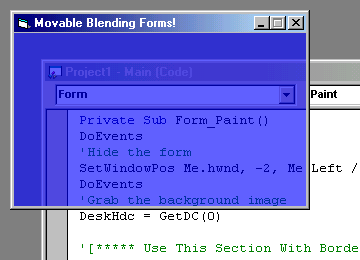



## Self updaing transparent / translucent form

### Description

Self updaing transparent / translucent form. It's cthru!

(Expanded on Kevin Tupper's and BoS's work.)
 
### More Info
 
cthru - (0-255) - set opacity

- The two "SetWindowPos" routines are cranky. They don't want to accept variables as their sizes. The numbers have to be hard coded in at design time.

- In the "Paint" routine you'll need to rem out some statements depending on whether the form will have a border or not. (It's clearly marked)

- Msimg32.dll & Alphablending.dll are in the zip. If your computer does not have these files you may need to install them before running the project.

- Next I want to include region clipping so I can round off the edges of the window. I have no idea if this will affect the blending routine.

Make the specified form cthru!

The form flickers slightly while it hides it self to take the clean snapshot of the background.

             |
---                |---
**Submitted On**   |2000-06-11 05:49:38
**By**             |[Brian Kurtyka](https://github.com/Planet-Source-Code/PSCIndex/blob/master/ByAuthor/brian-kurtyka.md)
**Level**          |Advanced
**User Rating**    |4.8 (24 globes from 5 users)
**Compatibility**  |VB 5\.0, VB 6\.0
**Category**       |[Custom Controls/ Forms/  Menus](https://github.com/Planet-Source-Code/PSCIndex/blob/master/ByCategory/custom-controls-forms-menus__1-4.md)
**World**          |[Visual Basic](https://github.com/Planet-Source-Code/PSCIndex/blob/master/ByWorld/visual-basic.md)
**Archive File**   |[CODE\_UPLOAD67296132000\.zip](https://github.com/Planet-Source-Code/brian-kurtyka-self-updaing-transparent-translucent-form__1-8817/archive/master.zip)

